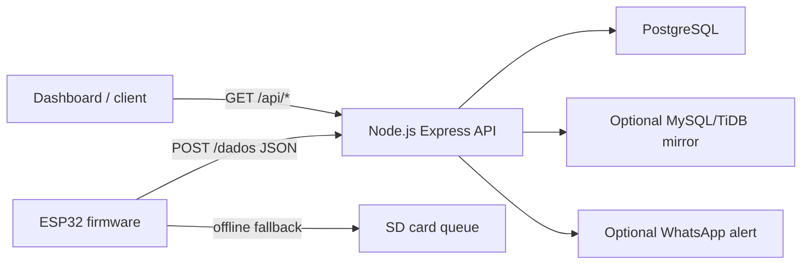

# PureAir

PureAir is an academic IoT prototype for monitoring air-conditioner filter health. An ESP32 collects pressure, temperature, and timestamp data, sends JSON readings to a Node.js API, stores the readings in PostgreSQL, and can trigger status alerts for clean, attention, and maintenance states.

## Why It Exists

Air-conditioner filters are often maintained too late, after poor airflow, smell, or equipment issues become visible. PureAir explores predictive filter maintenance using sensor readings and local status feedback, reducing waste from early replacement and risk from delayed maintenance.

## Features

- ESP32 firmware for periodic sensor readings.
- HTTP POST integration between the microcontroller and backend.
- Offline SD-card storage when Wi-Fi or the API is unavailable.
- PostgreSQL persistence for historical readings.
- Optional MySQL/TiDB mirror for dashboard integrations.
- Optional WhatsApp alert integration through UltraMsg.
- REST endpoints for latest readings, recent readings, status, and aggregate stats.

## Tech Stack

- Firmware: Arduino/C++ for ESP32.
- Backend: Node.js, Express, PostgreSQL, MySQL/TiDB.
- Data format: JSON over HTTP.
- Hardware: ESP32, BMP180/BMP280-style pressure sensor, RTC module, SD-card module, status LEDs.

## Architecture



## Project Structure

```text
Arduino/
  codigoFinal_pureair.ino
server/
  server.js
  package.json
  package-lock.json
  .env.example
docs/
  project-summary.md
```

## Running the Backend

```bash
cd server
npm install
cp .env.example .env
npm start
```

Configure `.env` with your database and optional alert credentials before running. Real secrets are intentionally not committed.

Main endpoints:

- `POST /dados` receives ESP32 readings.
- `GET /medidas` returns the latest 20 records.
- `GET /api/latest` returns the latest record.
- `GET /api/recent?limit=50` returns recent records.
- `GET /api/status` returns the current filter status.
- `GET /api/stats` returns aggregate statistics.

## Firmware

Copy `Arduino/config.example.h` to `Arduino/config.h`, fill in the Wi-Fi and backend values, then open `Arduino/codigoFinal_pureair.ino` in the Arduino IDE and upload it to the ESP32.

Required Arduino libraries:

- ArduinoJson
- SdFat
- RTClib
- Adafruit Unified Sensor
- Adafruit BMP085 Unified or compatible pressure library

## Repository Hygiene

This repository intentionally ignores `node_modules`, downloaded Arduino libraries, archives, local reports, and environment files. That keeps the public GitHub repository focused on source code and documentation.
