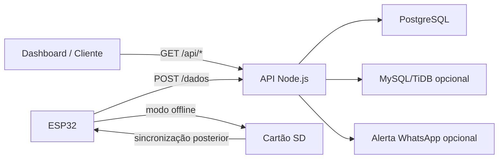

# 🌬️ PureAir 
<p align="left">
  
  
  
  
  
</p>

O **PureAir** é um protótipo de IoT para monitoramento da condição de filtros de ar-condicionado.

O sistema utiliza um **ESP32** para coletar dados de pressão, temperatura e horário da leitura. Essas informações são enviadas para uma **API em Node.js**, armazenadas em banco de dados e usadas para indicar o estado do filtro.

A ideia é apoiar a manutenção preventiva, ajudando a identificar quando o filtro está em condição normal, em atenção ou precisando de limpeza/manutenção.

## 🎯 Objetivo

Filtros de ar-condicionado geralmente são limpos ou trocados tarde demais, apenas quando já existe perda de eficiência, mau cheiro, queda no fluxo de ar ou piora na qualidade do ambiente.

O **PureAir** busca resolver esse problema com um sistema simples de monitoramento, combinando sensores, armazenamento de dados e alertas para apoiar decisões de manutenção com base em medições reais.

## ⚙️ Funcionalidades

- Leitura periódica de sensores pelo ESP32.
- Envio dos dados para o backend via HTTP POST.
- Armazenamento local em cartão SD quando não há conexão.
- Sincronização posterior dos dados pendentes.
- API REST para consulta das medições.
- Persistência dos dados em PostgreSQL.
- Integração opcional com MySQL/TiDB.
- Envio opcional de alertas via WhatsApp.
- Classificação do filtro por status: verde, amarelo e vermelho.

## 🧰 Tecnologias Utilizadas

- **ESP32**
- **Arduino/C++**
- **Node.js**
- **Express**
- **PostgreSQL**
- **MySQL/TiDB**
- **ArduinoJson**
- **SdFat**
- **RTClib**
- **Sensores de pressão/temperatura**

## 🏗️ Arquitetura



## 📁 Estrutura do Projeto

```text
Arduino/
  codigoFinal_pureair.ino
  config.example.h

server/
  server.js
  package.json
  package-lock.json
  .env.example

docs/
  project-summary.md
```

## 🔌 Principais Endpoints

### Receber dados do ESP32

```http
POST /dados
```

Exemplo de payload:

```json
{
  "timestamp": "2025-10-21T14:30:00",
  "temperatura": 25.4,
  "pressao_barometrica": 1008.2,
  "pressao_barometrica_final": 1011.7,
  "status_filtro": "VERDE"
}
```

### Consultar últimas medições

```http
GET /medidas
```

### Consultar última leitura

```http
GET /api/latest
```

### Consultar leituras recentes

```http
GET /api/recent?limit=50
```

### Consultar status atual

```http
GET /api/status
```

### Consultar estatísticas

```http
GET /api/stats
```

## 🤖 Configuração do Firmware

Copie o arquivo de exemplo:

```text
Arduino/config.example.h
```

Crie um arquivo chamado:

```text
Arduino/config.h
```

Configure nele os dados da rede Wi-Fi e o endereço do backend:

```cpp
#define WIFI_SSID "nome-da-rede"
#define WIFI_PASSWORD "senha-da-rede"

#define SERVER_IP "xx"
#define SERVER_PORT 3000
#define SERVER_PATH "/dados"
```

Depois abra o arquivo abaixo na Arduino IDE:

```text
Arduino/codigoFinal_pureair.ino
```

Instale as bibliotecas necessárias e envie o código para o ESP32.

## 📚 Bibliotecas Necessárias no Arduino

- ArduinoJson
- SdFat
- RTClib
- Adafruit Unified Sensor
- Adafruit BMP085 Unified ou biblioteca compatível com o sensor utilizado

## 📌 Status do Projeto

Projeto desenvolvido como parte do **Projeto Integrador I**.
